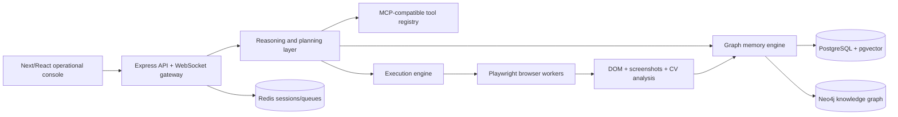

# QA Master Agent Architecture

## Major modules

- `server/services/knowledgeGraph.js` owns semantic, episodic, visual, workflow, and execution memory. It versions every material ingestion or execution refinement.
- `server/services/vectorPipeline.js` chunks onboarding material and creates local vectors behind an adapter boundary that can be backed by hosted embedding providers.
- `server/services/executionEngine.js` runs Playwright browser sessions, emits WebSocket events, and records replayable evidence.
- `server/services/toolRegistry.js` provides MCP-compatible dynamic tool registration, scoped permissions, and audit logging.
- `server/services/agentRegistry.js` defines specialized QA, onboarding, regression, and validation agents with independent strategies and tool scopes.

## Data flow

1. Knowledge enters through document, screenshot, workflow, or rule ingestion.
2. The ingestion pipeline chunks content, embeds it, creates graph nodes/relationships, and creates a new memory version.
3. Actions retrieve hybrid lexical/vector context, generate an execution plan, stream session logs, capture UI frames, and link execution-derived learning back to graph memory.
4. Chat retrieves cited memory nodes and answers informational questions without executing browser actions.

## Scalability considerations

- Use Neo4j constraints in `infra/db/neo4j.cypher` when promoting the file-backed graph state to a clustered graph backend.
- Persist chunks and embeddings in PostgreSQL/pgvector using `infra/db/postgres.sql`.
- Run Playwright workers behind Redis queues for sandboxed, horizontally scalable browser execution.
- Keep WebSocket gateways stateless by publishing execution events through Redis streams or a durable queue.
